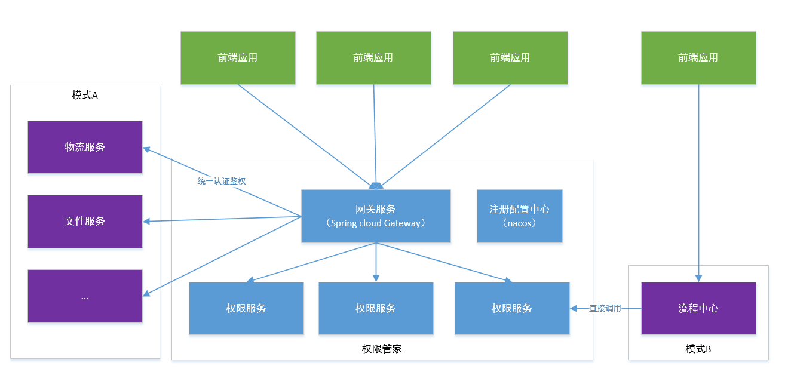
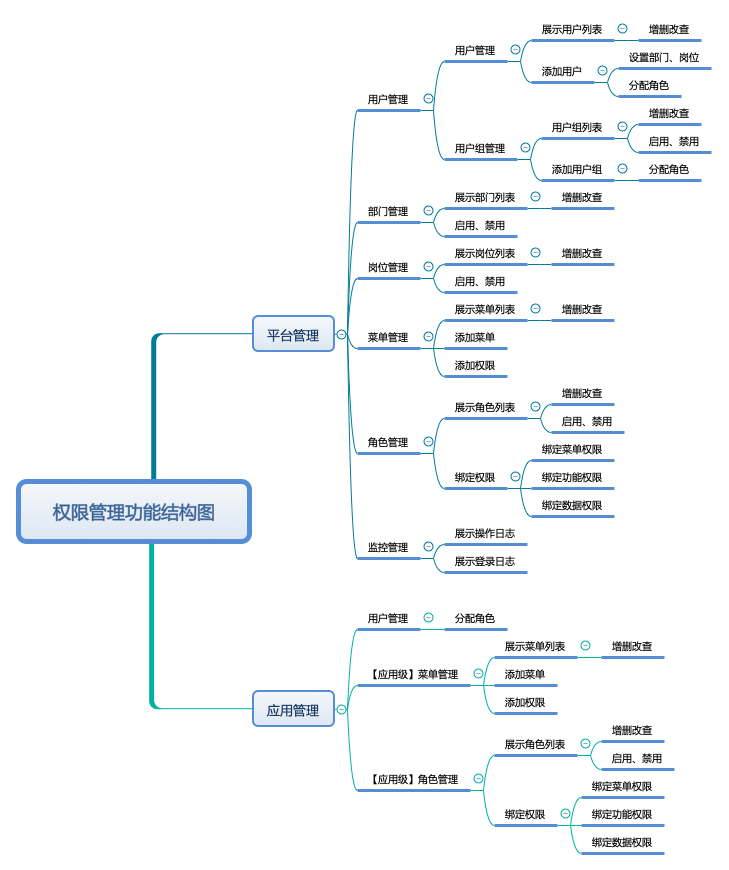
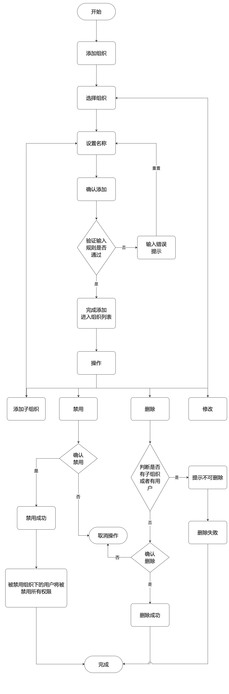

itcast-authority 权限管家- [官方主页](https://pip.itcast.cn/java-qxgj)
=========================

- [后端Gitee地址](https://gitee.com/itcastopen/itcast-authority.git)
- [后端Github地址](https://github.com/itcastopen/itcast-authority.git)
- [前端Gitee地址](https://gitee.com/itcastopen/itcast-authority-vue.git)
- [前端Github地址](https://github.com/itcastopen/itcast-authority-vue.git)


**在线演示**
=========================
- [演示地址](http://www-permission-admin.itheima.net)

**项目背景**
=========================

- 权限管理对于任何一个后台系统都非常重要，随着业务的发展，不同阶段的权限系统又面临着不同设计和重构，企业中不同业务系统权限控制方式不统一，维护和实现成本增加，开发对接效率低，实现方式多样化，用户各种权限分配需求不能满足，实现起来非常蹩脚，这样只会造成恶性循环，最终可能影响业务发展甚至推倒重做，我们极为迫切的需要一个通用权限系统，界面美观、安全性高、便于管理使用、不侵入业务、又可以支持并发量高个一个通用权限系统，那么传智品达通用权限系统应运而生，解决企业开发中遇到的痛点和难点，也是小伙伴们学习源码、设计模式、常用微服务架构等经典知识的平台和途径！

- [了解更多项目](https://project-dev.itheima.net/java)，改变命运，少走弯路，进入真项目知识海洋畅游。

功能特性
=========================


系统架构 
=========================


功能结构
=========================


技术架构
=========================


用户管理流程图
=========================


组织管理流程图
=========================


角色管理流程图
=========================


菜单管理流程图
=========================


更多流程图
=========================
[全部流程图](docs/img/流程图)


工程结构
=========================

``` 
itcast-authority
├
├── docs -- 相关图片、nacos、mysql、安装手册
├
├── itcast-auth --权限服务父级文件夹
├     ├
├     ├── itcast-auth-api -- 权限服务api
├     ├
├     ├── itcast-auth-entity -- 权限实体业务类
├     ├
├     └── itcast-auth-server -- 权限服务
├
└── itcast-gateway-- 网关服务 
```

环境要求
=========================

- JDK ： 1.8 +
- Maven： 3.3 +
  http://maven.apache.org/download.cgi
- Mysql： 5.6.0 +
  https://downloads.mysql.com/archives/community
- Redis： 4.0 +
  https://redis.io/download
- Nacos： 1.1.4
  https://github.com/alibaba/nacos/releases
- Node： 11.3+（集成npm）
  https://nodejs.org/en/download

安装运行步骤
=========================

- [安装部署手册（建议下载后查看，避免格式问题）](docs/安装手册/install.md)

页面一览
=========================


<br><br>


<br><br>


<br><br>


<br><br>


<br><br>

新的惊喜
=========================
想进步、要关注。关注老铁抖音号，成为'铁丝' ：）


<br><br>

更多福利
=========================

[了解更多项目](https://pip.itcast.cn/home)
